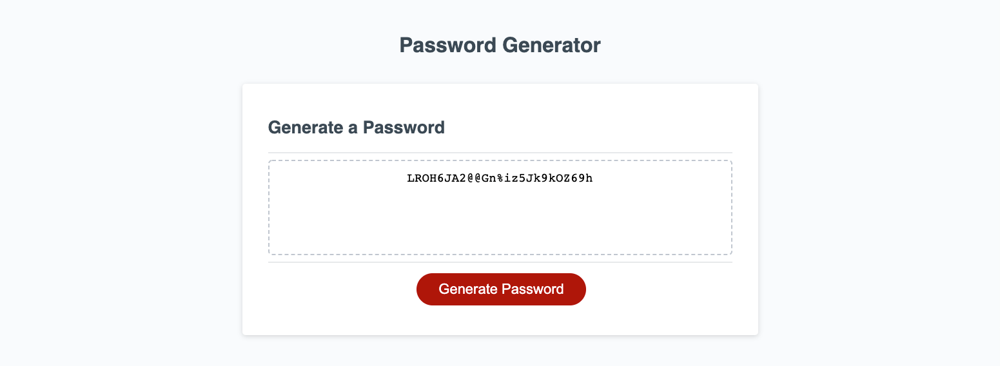

# Java-Password-Generator

## Description

Ever have a problem figuring out what password to use? With many websites requiring a password of uppercase letters, lowercase letters, numerical values, and special characters I built a random password generator that creates a password based on user prompts. This was my first javascript project that helped solidify my knowledge of arrays as well as loops.

## Table of Contents (Optional)

If your README is long, add a table of contents to make it easy for users to find what they need.

- [Installation](#installation)
- [Usage](#usage)
- [Credits](#credits)

## Installation

What are the steps required to install your project? Provide a step-by-step description of how to get the development environment running.

This application is live on the web on github. Please see the links below:

https://github.com/kgiunta/Javascript-Password-Generator

https://kgiunta.github.io/Javascript-Password-Generator/

## Usage

Below is the screen shot of the final generated password.

## Credits

Juan Delgado | Penn LPS Tutor  
Isaak Morales|https://github.com/CallMeIce  
Julian Richardson |https://github.com/julianr3

